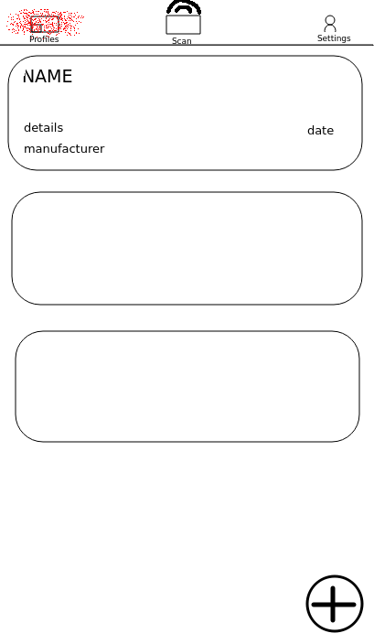
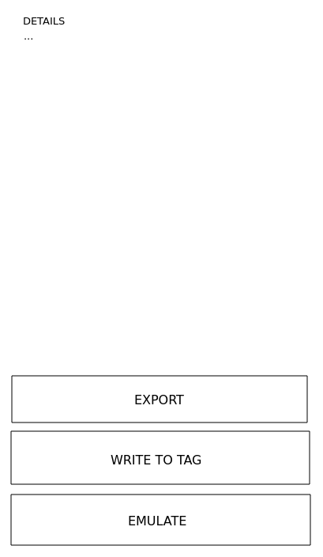
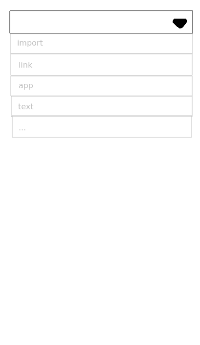
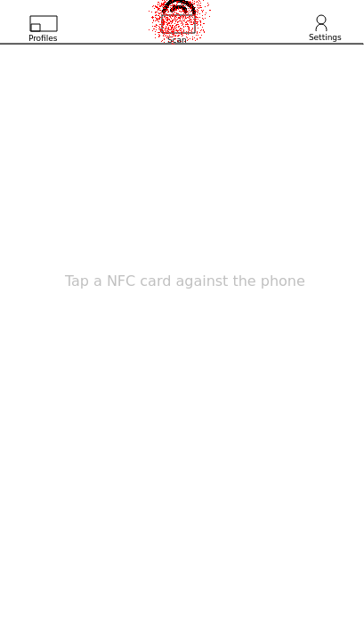
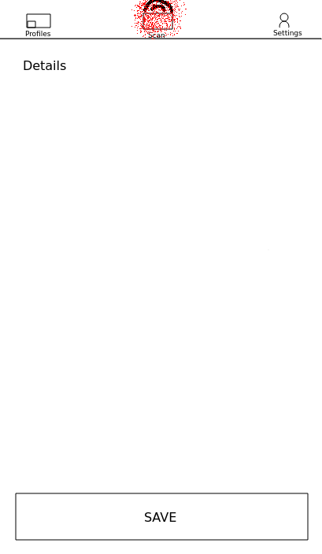
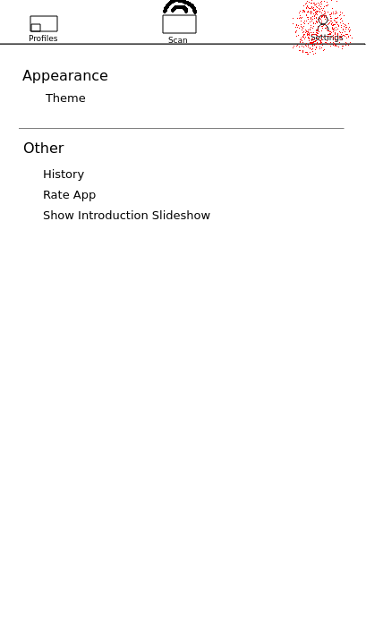

# Project Proposal NFC Droid

With this app users will be able to read and write NFC-Tags. By tapping a NFC-Tag at the back of an Android smartphone, the tags profile will be stored on the phone. Alternatively users will be able to create custom NFC-Profiles by entering text, a URL, a app to start, loading their contacts into a profile (dangerous permission), downloading profiles from a web server, etc. .
It will be possible to take many actions with profiles, namely: delete, write to tag, emulate.

Different protocols (e-passport, debit-card, ...) might be also be implemented, depending on their complexity and availability of specifications.

## API

Users will be able to save their NFC profiles to a custom server.

## GUI

### Slideshow

When users start the app for the first time a slideshow will appear:

### Profiles Tab

*Profiles Main Screen*

*Profile Detail Screen*

*Custom Profile Screen*

### Scan Tab

### Settings Tab

